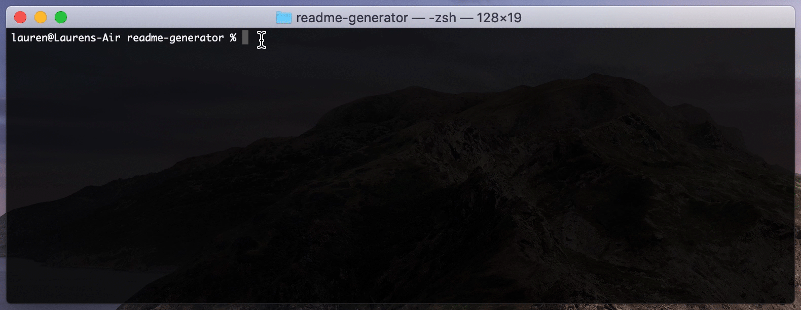
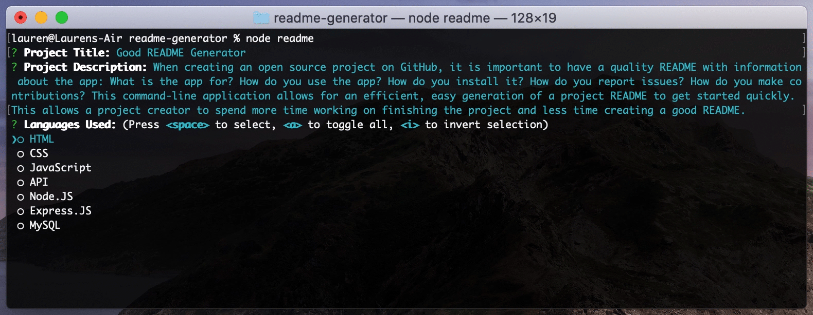
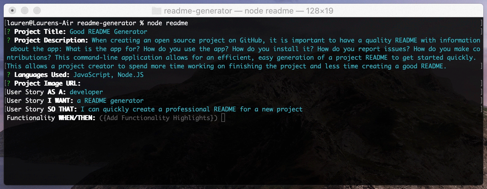

# Good README Generator
When creating an open source project on GitHub, it is important to have a quality README with information about the app: What is the app for? How do you use the app? How do you install it? How do you report issues? How do you make contributions? This command-line application allows for an efficient, easy generation of a project README to get started quickly. This allows a project creator to spend more time working on finishing the project and less time creating a good README.

      


## User Story
```
As a developer
I want a README generator
So that I can quickly create a professional README for a new project
```


## Functionality
```
WHEN I am prompted for information about my application repository
THEN a quality, professional README.md is generated with the title of my project, description, user story, functionality highlights, table of contents, installation, usage, walkthrough video, contributing, tests, questions, credits, donate, and license.
WHEN I enter my project title
THEN this is displayed as the title of the README
WHEN I select which languages I used in my project
THEN the badge for that language is displayed in my final file
WHEN I answer all other prompts
THEN this information is added to their appropriate sections
WHEN I skip a non-required prompt
THEN that section is hidden altogether in the final file
WHEN I skip a required prompt
THEN a default placeholder value is added to the final file to update later
WHEN I click on the links in the Table of Contents
THEN I am taken to the corresponding section of the README
```


## Table of Contents
* [Installation](#installation)
* [Usage](#usage)
* [Walkthrough](#walkthrough)
* [Contributing](#contributing)
* [Tests](#tests)
* [FAQ](#faq)
* [Credits](#credits)
* [Donate](#donate)
* [License](#license)


## Installation
* Download the `readme.js` file from this repository and add it to your own repository folder.
* Create (or update) a `.gitignore` file and add `node_modules/` and `.DS_Store/` to it.
```
node_modules/
.DS_Store/
```
* Install the Inquirer package through a command line npm install.
```
npm install inquirer
```


## Usage
Start the application by typing `npm readme`:


Make sure to select at least one programming language that you've used in order to display the badge in your file (you can select multiple if you'd like):


Note that multilines are not supported at this time. Only enter single paragraphs of text and you can manually edit them later if need be:


Continue answering the prompts until you've reached the 'Success' message at the end:
 

Once generated, open up your readme file to make any changes you'd like before committing:


Commit your file to Github and see it in action:


## Walkthrough
[](https://about.gitlab.com/handbook/markdown-guide/#images)


## Contributing
Lorem ipsum dolor sit amet, consectetur adipiscing elit. Maecenas vehicula elementum ex vel rutrum. Etiam auctor sem in ipsum luctus, non mollis lorem bibendum. Cras eget fermentum sapien.


## Tests
Lorem ipsum dolor sit amet, consectetur adipiscing elit. Maecenas vehicula elementum ex vel rutrum. Etiam auctor sem in ipsum luctus, non mollis lorem bibendum. Cras eget fermentum sapien.


## Credits
This CLI App wouldn't run without the [Inquirer Package](https://github.com/SBoudrias/Inquirer.js). Badges created with the help of [Shields](https://shields.io).


## Questions
If you have any questions, feel free to find me at any of the following:
* Email: laurensiminski@gmail.com
* Website: https://siminski.co
* Github: [@siminski](https://github.com/siminski)


## Donate
Appreciate this code? Say thanks with a coffee:

[](https://ko-fi.com/W7W21YVJJ)


## License
Copyright (c) 2020 Lauren Siminski. Licensed under the MIT license.